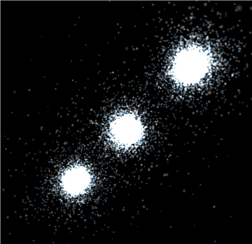
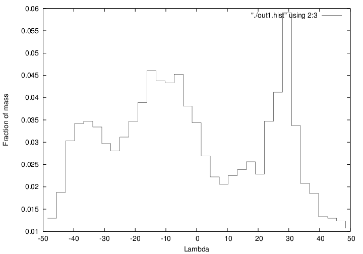
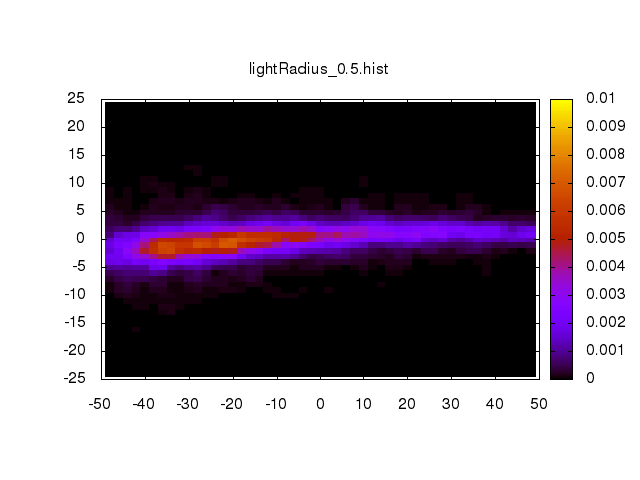

class: center, middle, inverse

# Milkyway@Home N-Body
###Roland Judd - 06/25/2014

---

class: normal
# Overview

##1. Intro to Lua

##2. Lua Integration

##3. 2D Histograms

##4. Earth Mover Distance

---

class: normal
# Intro to Lua

##1. What is Lua?
- Embeddable scripting language 
- Compiled into bytecode at runtime, which is executed on the Lua virtual machine
- Register based VM similar to Android's Dalvik or Parrot
 
##2. Why do we use it?

- Small footprint (~180 kB compiled)
- C API for interaction with host application
- Allows complete control over the simulation without recompiling and releasing a new application

---

class: normal
# Intro to Lua

.left-column[
##Tables
]

.right-column[

Lua supports several simple datatypes, including boolean values, double precision floating point numbers, and strings.

Lua has a single complex data type, the table.  A table stores a collection of key value pairs, where data is accessed based on it's key.  This is similar to Dictionaries in Python, or a HashMap in Java. 


```lua
a_table = {}        // Creates a new, empty table
a_table["x"] = 10   // Insert the value 10, with the key "x"

// Prints the value associated with the key "x"
print(a_table["x"]) 
```
]

???

Explain heterogeneous

---

class: normal
# Intro to Lua

.left-column[
##Tables
]

.right-column[

Tables are used as the basis for many data structures in lua.  Arrays are simply tables with a numeric key.

```lua
array = {}        // Creates a new, empty table
array[0] = 1 
array[1] = 2 
```

The equivalent of a C struct is implemented in lua using tables as well.  The dot notation is completely identical to the bracket notation when accessing a table by a string key.

```lua
point = { x = 10, y = 20 }   // Create new table
print(point["x"])            // Prints 10
print(point.x)               // Same as previous line
```
]

---

class: normal
# Intro to Lua

.left-column[
##Functions
]

.right-column[

Functions are first class values in Lua, they can be referenced by a variable, passed as an argument to a function, or returned by a function.

Lua also supports closures and anonymous functions.
```lua
function factorial(n)
  local x = 1
  for i = 2,n do
    x = x * i
  end
  return x
end

f = factorial
f(4)
```
]

---

class: normal
# Intro to Lua

.left-column[
##Loops
]

.right-column[

While loop
```lua
while condition do
  // statements
end
```

Repeat loop (similar to do while in C)
```lua
repeat
  // statements
until condition
```

For loop (Numeric values, delta may be negative to iterate in reverse)
```lua
for i = first,last,delta do    
  // statements
end
```
]

---

class: normal
# Intro to Lua

.left-column[
##Loops
]

.right-column[

For loop (iterating over key value pairs in table).  Uses the pairs function.
```lua
for key, value in pairs(_G) do
  print(key, value)
end
```

For loop (iterating over values in an array).  Uses the ipairs function.
```lua
for i, v in ipairs(array) do
  print(i, v)
end
```

Break behaves in a similiar manner to C or C++.  The continue statement doesn't exist and may be emulated using goto statements.

]

---

class: normal
# Intro to Lua

.left-column[
##Conditions
]

.right-column[

If statement, elsif and else blocks are optional as usual.
```lua
if condition then
  // statement
elseif condition2 then
  // statement
elseif condition3 then
  // statement
else
  // statement
end
```

]


---

class: inverse, middle, center
#Lua Integration with milkyway_nbody

---

class: normal
# Lua Integration

##3. How does it work?
- A Lua script is downloaded for a given BOINC workunit, which contains certain functions necessary for setting up the simulation

- Work units parameters are passed from the command line arguments of the C program to the lua script

- BOINC starts a milkyway_nbody executable, which initializes an embedded lua environment and loads the script specified the -f flag.

- The milkyway_nbody application used the Lua C API to execute functions within the lua enviroment and transfer the results to the C program.

---

class: normal
# Argument Forwarding

### Command Line

```bash
x1arch% milkyway_nbody -f EMD_10k_isotropic2.lua -z out.hist  2 1 1 0.5 10 0.5
```

Command line arguments unused by milkyway_nbody are forwarded to the lua script, and can be accessed as command line arguments within the lua script.

### Lua Script

```lua 
evolveTime       = arg[1]
reverseOrbitTime = arg[1] / arg[2]
r0               = arg[3]
light_r_ratio    = arg[4]
```

---

class: normal
# Lua C API Example

```c
#include <lua.h> //Lua main library (lua_*)
#include <lauxlib.h> //Lua auxiliary library (luaL_*)
 
int main(void)
{
    //create a Lua state
    lua_State *L = luaL_newstate();
 
    //load and execute a string
    if (luaL_dostring(L, "function foo (x,y) return x+y end")) {
        lua_close(L);
        exit(EXIT_FAILURE);
    }
 
    //push value of global "foo" (the function defined above)
    //to the stack, followed by integers 5 and 3
    lua_getglobal(L, "foo");
    lua_pushinteger(L, 5);
    lua_pushinteger(L, 3);
    lua_call(L, 2, 1); //call a function with two arguments and one return value
    
    //print integer value of item at stack top
    printf("Result: %d\n", lua_tointeger(L, -1)); 
    lua_close(L); //close Lua state
    return 0;
}
```

---

class: normal
#Lua C Binding

Functions written in C are bound to a global name in the lua interpreter, and can be called directly from the lua script

```c
#define DISK_TYPE "Disk"
```

```c
static const luaL_reg methodsDisk[] =
{
    { "miyamotoNagai", createMiyamotoNagaiDisk },
    { "exponential",   createExponentialDisk   },
    { NULL, NULL }
};
```
 
```c
int registerDisk(lua_State* luaSt)
{
    return registerStruct(luaSt,
                          DISK_TYPE,
                          gettersDisk,
                          settersDisk,
                          metaMethodsDisk,
                          methodsDisk);
}
```

---
class: normal
# Calling Functions from Lua

Lua script
```lua
disk = Disk.miyamotoNagai{  mass = 4.45865888e5, 
                            scaleLength = 6.5, 
                            scaleHeight = 0.26 }
```

body/src/nbody_lua_types/nbody_lua_disk.c
```c
static int createMiyamotoNagaiDisk(lua_State* luaSt)
{
    static Disk d = { MiyamotoNagaiDisk, 0.0, 0.0, 0.0 };

    static const MWNamedArg argTable[] =
        {
            { "mass",        LUA_TNUMBER, NULL, TRUE, &d.mass        },
            { "scaleLength", LUA_TNUMBER, NULL, TRUE, &d.scaleLength },
            { "scaleHeight", LUA_TNUMBER, NULL, TRUE, &d.scaleHeight },
            END_MW_NAMED_ARG
        };

    return createDisk(luaSt, argTable, &d);
}
```
---

class: normal
# Named Argument Table

Many of functions registered within the lua environment use an argument table as their only parameter.  This allows the user to specificy the values in a simple, intuitive manner.  

```c
static const MWNamedArg argTable[] =
{
  { "phi",         LUA_TNUMBER, REAL_TYPE, TRUE, &hp.phi         },
  { "theta",       LUA_TNUMBER, REAL_TYPE, TRUE, &hp.theta       },
  { "psi",         LUA_TNUMBER, REAL_TYPE, TRUE, &hp.psi         },
  { "lambdaStart", LUA_TNUMBER, REAL_TYPE, TRUE, &hp.lambdaStart },
  { "lambdaEnd",   LUA_TNUMBER, REAL_TYPE, TRUE, &hp.lambdaEnd   },
  { "lambdaBins",  LUA_TNUMBER, UINT_TYPE, TRUE, &hp.lambdaBins  },
  { "betaStart",   LUA_TNUMBER, REAL_TYPE, TRUE, &hp.betaStart   },
  { "betaEnd",     LUA_TNUMBER, REAL_TYPE, TRUE, &hp.betaEnd     },
  { "betaBins",    LUA_TNUMBER, UINT_TYPE, TRUE, &hp.betaBins    },
  END_MW_NAMED_ARG
};
```

---

class: normal
# Named Argument Table

Named Argument Table
```lua
function makeHistogram()
    return HistogramParams.create{
      phi = 128.79,
      theta = 54.39,
      psi = 90.70,
      lambdaStart = -50,
      lambdaEnd = 50,
      lambdaBins = 50,
      betaStart = -25,
      betaEnd = 25,
      betaBins = 50 
    }
end
```

Conventional Function Call
```lua
function makeHistogram()
    return HistogramParams.create(128.79, 54.39, 90.70, -50, 50, 50, -25, 25, 50)
end
```

---

class: normal
# Required Functions
### The following functions are required for setting up an nbody simulation.  The lua file must contain all of them, and they must return the correct type of data.

1. makeContext()

2. makePotential()

4. makeHistogram()

3. makeBodies(context, potential)

---
class: normal
## 1. makeContext()

Returns the context for running the simulation.  The following options are available. 

|Parameter  | Type   | Explanation |
|:----------|:-------|:----------- |
|timestep   | Number | Size of timestep in gigayears 
|timeEvolve | Number | Time to run the simulation in gigayears 
|theta      | Number | Barnes-Hut opening angle 
|eps2       | Number | Softening parameter in kiloparsec^2 
|treeRSize  | Number | Initial size guess of tree root cell
|sunGCDist  | Number | Distance from galactic center to Earth in kiloparsecs
|criterion  | Enum   | Determine opening criteria for tree traversal
|useQuad    | Bool   | Use quadrupole moments for calculating forces
|allowIncest| Bool   | Permit tree incest errors when traversing the tree
|quietErrors| Bool   | Silence printing of certain errors 

---

class: normal
## 1. makeContext()
### Example

```lua
function makeContext()
   return NBodyCtx.create{
      timeEvolve = evolveTime,
      timestep   = sqr(1/10.0) * sqrt((pi_4_3 * cube(r0)) / (encMass + dwarfMass)),
      eps2       = calculateEps2(totalBodies, r0),
      criterion  = "NewCriterion",
      useQuad    = true,
      theta      = 1.0
   }
end
```

---

class: normal
##2. makePotential()

Returns the external potential to be used in the simulation.  Options are as follows.

|Option     | Explanation |
|:----------|:----------- |
|nil        |Run an nbody simulation with no external potential.  
|Potential  |A combination of options for bulge, disk, and halo
|Lua Closure|An arbitrary lua function that takes three arguments (x, y, z) in standard galactic coordinates and returns an acceration vector.  Cannot be used with OpenCL currently

---

class: normal
##2. makePotential()

If the Potential type is used, the following components of the external potenial are available and may be combined in any way.


|Component            | Parameters |
|:--------------------|:--------|
|Spherical.spherical  | mass, scale 
|Disk.miyamotoNagai   | mass, scaleLength, scaleHeight
|Disk.exponential     | mass, scaleLength
|Halo.logarithmic     | vhalo, scaleLength, flattenZ
|Halo.nfw             | vhalo, scaleLength
|Halo.triaxial        | vhalo, scaleLength, flattenX, flattenY, flattenZ, triaxAngle

---

class: normal
##2. makePotential()

### Example

```lua
function makePotential()
   return  Potential.create{

      spherical = Spherical.spherical{  mass  = 1.52954402e5, 
                                        scale = 0.7 },

      disk      = Disk.miyamotoNagai{   mass = 4.45865888e5, 
                                        scaleLength = 6.5, 
                                        scaleHeight = 0.26 },

      halo      = Halo.logarithmic{     vhalo = 73, 
                                        scaleLength = 12.0, 
                                        flattenZ = 1.0 }
   }
end
```
---

class: normal
##3. makeHistogram()

The makeHistogram function returns the the histogram parameters to be used when generating a histogram, after the simulation is completed.

### The program currectly expects the following parameters:

phi, theta, startRaw, endRaw, binSize, center

### Once the 2d histogram version is released, the program will expect:

phi, theta, psi, lambdaStart, lambdaEnd, lambdaBins, betaStart, betaEnd, betaBins  


---

class: normal
##3. makeHistogram()

### Example

```lua
function makeHistogram()
   return HistogramParams.create{
     phi = 128.79,
     theta = 54.39,
     psi = 90.70,
     lambdaStart = -50,
     lambdaEnd = 50,
     lambdaBins = 50,
     betaStart = -25,
     betaEnd = 25,
     betaBins = 50 
}
end
```

```lua
function makeHistogram()
   return HistogramParams.create{}
end
```

---

class: normal
##4. makeBodies()

The makeBodies function must return at least one table of bodies, which can be arranged in any manner.  You can create the bodies directly in the lua file, or use one of the predefined models available.  

To create individual bodies, using Body.create{} with a named argument table.

|Argument  | Type | Explanation |
|:---------|:-----|:------------|
|mass      |Number| Mass of particle |
|position  |Vector| Position of particle in xyz coordinates |
|velocity  |Vector| Initial velocity of particle |
|ignore    |Bool  | Set to true for dark matter |

There is also a reverseOrbit function available to evolve a single particle backwards in time in the external potential specified.

---

class: normal
##4. makeBodies()

The following predefined models are available

|Model Name  | Parameters |
|:-----------|:------------|
|plummer     | nbody, mass, scaleRadius, position, velocity, ignore, prng |
|nfw         | nbody, mass, rho_0, scaledRadius, position, velocity, ignore, prng |
|hernq       | nbody, mass, radius, a, position, velocity, ignore, prng |
|isotropic   | nbody, mass1, mass2, scaleRadius1, scaleRadius2, position, velocity, ignore, prng |

The position and velocity parameters must be vectors, which can be created using Vector.create(x, y, z) in the lua file.  This is possible since the Vector struct is registered in the lua enviroment.  

The prng parameter refers to an instance of the DSFMT pseudo random number generator. 
---

class: normal
##4. makeBodies()

### Example - Using reverseOrbit
```lua
function makeBodies(ctx, potential)
   local firstModel, secondModel
   local finalPosition, finalVelocity = reverseOrbit{
      potential = potential,
      position  = lbrToCartesian(ctx, Vector.create(218, 53.5, 28.6)),
      velocity  = Vector.create(-156, 79, 107),
      tstop     = reverseOrbitTime,
      dt        = ctx.timestep / 10.0
   }

   model = predefinedModels.plummer{
      nbody       = model1Bodies,
      prng        = prng,
      position    = finalPosition,
      velocity    = finalVelocity,
      mass        = dwarfMass,
      scaleRadius = r0,
      ignore      = false
   }

   return model
end
```

---

class: normal
##4. makeBodies() - multiple galaxies

The makeBodies function must return one or more tables of bodies.  You can return multiple values from a function in lua, and the C function evaluateBodies will evalulate each returned value.

```lua
function makeBodies(ctx, potential)
    
    model1 = predefinedModels.plummer{
        nbody       = model1Bodies,
        prng        = prng,
        position    = Vector.create(200, 50, 25),
        velocity    = Vector.create(),
        mass        = dwarfMass * arg[6],
        scaleRadius = r0,
    }    

    model2 = predefinedModels.plummer{ }
  
    model3 = predefinedModels.plummer{ }    

    return model1, model2, model3

end
```
---

class: normal
##4. makeBodies() - multiple galaxies

.center[

]

---

class: center, middle, inverse
# 2D Histograms & EMD

---

class: normal
# 1D Histogram Example

.center[

]

---

class: normal
# 2D Histogram Example

.center[

]

---

class: normal
# 2D Histogram 

### File format
The histograms are saved as a text file, similiar to the 1d histogram's but with several added parameters and an additional column.

```
n = 10000
massPerParticle = 0.0005000000
totalSimulated = 20000
lambdaBins = 50
betaBins = 50

# UseBin  Lambda         Beta           Probability  Error
  1       -49.0000000000 -24.5000000000 0.0000000000 0.0001567890
  1       -49.0000000000 -24.0000000000 0.0000000000 0.0001567890
```

The value of lambda will remain contant while beta sweeps over the entire range.  Essentially row major order, where lambda is the row and beta is the column.

---

class: normal
# 2D Histogram

### Plotting

The file format was designed so that they can be easily plotted using gnuplot.

```matlab
set term png
set output "./histogram.png"
set pm3d map
set title "2d Histogram"
splot "./out.hist" using 2:3:4
```
Gnuplot can easily be used to plot multiple histograms simultaneously, using bash or a similiar scripting language.

```bash
for f in ./*.hist; 
  do gnuplot <<< "set title \"$f\";"
                  "set term png;"
                  "set output \"${f%.*}\";"
                  "set pm3d map;"
                  "splot \"$f\" using 2:3:4;""
  done
``` 

---

class: normal
# Earth Movers Distance

Earth movers distance is a measure of the distance between two probability distributions over a region.  The histograms must be normalized before computing the EMD. 

The existing EMD implementation was adapted from the following site:
http://ai.stanford.edu/~rubner/emd/default.htm

By defining a distance metric in 2D, we were able to reuse the majority of the exising code.

However, the calculation is very computationally expensive and will fail with a memory allocation error if the number of bins is very large.  The maximum number of bins will depend on the amount of RAM in the system, but 50 x 50 bins should be a good maximum size for workunits on MilkyWay@Home.  

If a larger number of bins is necessary, we may need to switch to a different likelihood method.

---
class:inverse
# Future Work

### Release 2D histogram version
### OpenCL N-body

---
class: inverse, center, middle
### Any Questions?
